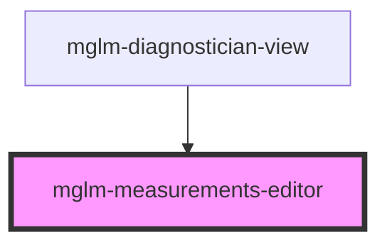

# mglm-measurements-editor

<!-- Auto Generated Below -->

## Properties

| Property       | Attribute | Description | Type                                        | Default           |
| -------------- | --------- | ----------- | ------------------------------------------- | ----------------- |
| `measurements` | --        |             | `MeasurementValue[]`                        | `[]`              |
| `role`         | `role`    |             | `"diagnostician" \| "docs" \| "technician"` | `'diagnostician'` |

## Events

| Event                 | Description | Type                              |
| --------------------- | ----------- | --------------------------------- |
| `measurementsChanged` |             | `CustomEvent<MeasurementValue[]>` |

## Dependencies

### Used by

 - [mglm-diagnostician-view](../mglm-diagnostician-view)

### Graph

----------------------------------------------

*Built with [StencilJS](https://stenciljs.com/)*
