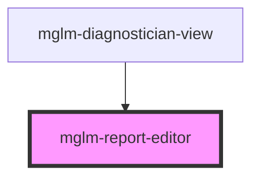

# mglm-report-editor

<!-- Auto Generated Below -->

## Properties

| Property      | Attribute     | Description | Type                                                                 | Default                                                               |
| ------------- | ------------- | ----------- | -------------------------------------------------------------------- | --------------------------------------------------------------------- |
| `canDiscard`  | `can-discard` |             | `boolean`                                                            | `false`                                                               |
| `reportDraft` | --            |             | `{ summary: string; conclusion: string; recommendations?: string; }` | `{     summary: '',     conclusion: '',     recommendations: '',   }` |

## Events

| Event                        | Description | Type                                                                              |
| ---------------------------- | ----------- | --------------------------------------------------------------------------------- |
| `reportDraftChanged`         |             | `CustomEvent<{ summary: string; conclusion: string; recommendations?: string; }>` |
| `reportFinalized`            |             | `CustomEvent<void>`                                                               |
| `reportPreliminaryDiscarded` |             | `CustomEvent<void>`                                                               |
| `reportPreliminarySaved`     |             | `CustomEvent<void>`                                                               |

## Dependencies

### Used by

 - [mglm-diagnostician-view](../mglm-diagnostician-view)

### Graph

----------------------------------------------

*Built with [StencilJS](https://stenciljs.com/)*
