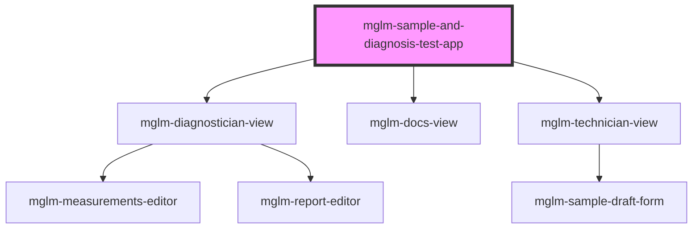

# mglm-sample-and-diagnosis-test-app

<!-- Auto Generated Below -->

## Properties

| Property               | Attribute                 | Description | Type     | Default     |
| ---------------------- | ------------------------- | ----------- | -------- | ----------- |
| `apiBase`              | `api-base`                |             | `string` | `undefined` |
| `basePath`             | `base-path`               |             | `string` | `''`        |
| `sampleAndDiagnosisId` | `sample-and-diagnosis-id` |             | `string` | `undefined` |

## Dependencies

### Depends on

- [mglm-diagnostician-view](../mglm-diagnostician-view)
- [mglm-docs-view](../mglm-docs-view)
- [mglm-technician-view](../mglm-technician-view)

### Graph

----------------------------------------------

*Built with [StencilJS](https://stenciljs.com/)*
