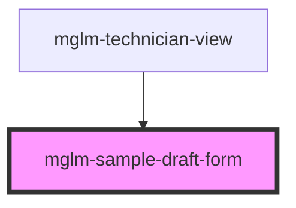

# mglm-sample-draft-form

<!-- Auto Generated Below -->

## Properties

| Property      | Attribute      | Description | Type             | Default                                                                                                                |
| ------------- | -------------- | ----------- | ---------------- | ---------------------------------------------------------------------------------------------------------------------- |
| `cancelLabel` | `cancel-label` |             | `string`         | `'Cancel'`                                                                                                             |
| `description` | `description`  |             | `string`         | `'The technician records sample metadata and selects required tests. Measured values are entered during diagnostics.'` |
| `draft`       | --             |             | `NewSampleDraft` | `undefined`                                                                                                            |
| `formTitle`   | `form-title`   |             | `string`         | `'Sample draft'`                                                                                                       |
| `submitLabel` | `submit-label` |             | `string`         | `'Save'`                                                                                                               |

## Events

| Event               | Description | Type                          |
| ------------------- | ----------- | ----------------------------- |
| `sampleDraftCancel` |             | `CustomEvent<void>`           |
| `sampleDraftSubmit` |             | `CustomEvent<NewSampleDraft>` |

## Dependencies

### Used by

 - [mglm-technician-view](../mglm-technician-view)

### Graph

----------------------------------------------

*Built with [StencilJS](https://stenciljs.com/)*
